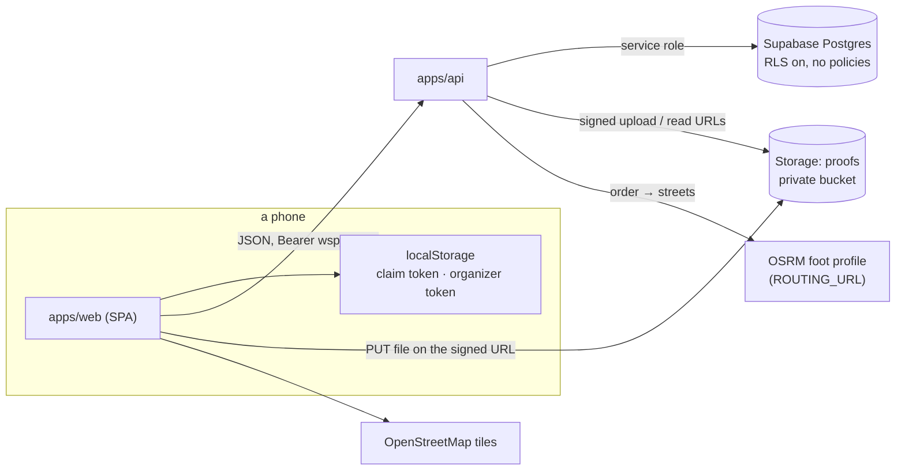

# Walkspot

Photo-proof challenge hunts for groups. An organizer writes a roster and a set
of challenges — some tied to a place on the map, some doable anywhere — and
shares a six-letter code. Each player opens the link on their phone, taps
their own name once, and that phone *is* them for the rest of the hunt. They
prove a challenge with a photo or video, tag whoever did it with them for a
group bonus, and plan the walk between the places that are left.

```
apps/api   Express + Supabase (service role) → Vercel      all the rules live here
apps/web   Vite + React + Tailwind + Leaflet → Vercel      renders and calls
ci.config.json   the CI pipeline (@mauur/ci)
```

## How it works



**No accounts.** Two credentials exist and the API mints both:

- a **claim** (`wsp_…`) — this device holds one roster spot. Written once to
  the phone; the app never offers a way to change it. Only an organizer can
  *release* the spot, which logs the phone out on its next request and
  reopens the name. → `apps/api/src/auth/README.md`
- an **organizer session** (`wso_…`) — this device knows the hunt's
  passphrase. Created with the hunt, or later by typing the passphrase on
  `/o/<code>`.

**Points are never stored.** A proof is worth
`base × (1 + min(cap, pct × (people − 1)) / 100)` to everyone tagged on it;
per person and challenge only the best approved proof counts; the board is
derived on every read. Reject a proof, archive a challenge, or change the
bonus, and the board simply moves. → `apps/api/src/submissions/README.md`

**Media never touches the API.** The client asks for a signed upload slot,
PUTs the file straight to the private bucket, then files the path. Reads are
signed URLs good for an hour.

**Routes** come from a pure nearest-neighbour + 2-opt order and, when the
router answers, real walking streets; otherwise straight lines drawn dashed.
→ `apps/api/src/route/README.md`

## Screens

| path | who | what |
|---|---|---|
| `/` | anyone | enter a code, or create a hunt; hunts this device is on |
| `/new` | anyone | name, passphrase, scoring rule → becomes its organizer |
| `/e/:code` | new phone | pick your name (irreversible, and it says so) |
| `/e/:code` … `/c/:id` `/map` `/feed` `/board` | player | challenges + score, proof form with tagging, map + route plan, everyone's proofs, leaderboard |
| `/o/:code` | organizer | passphrase sign-in, then People (add · release · remove), Challenges (map picker, radius, order), Review (approve/reject with the GPS distance), Feed, Board, Setup (share links, scoring) |

## Setup

```bash
npm run install:all
cp apps/api/.env.example apps/api/.env
cp apps/web/.env.example apps/web/.env
```

1. **Supabase** — create a project; put the URL and the service-role key in
   `apps/api/.env`. Connect the repo under *Integrations → GitHub* so
   `apps/api/supabase/migrations/` applies on merge (the migration also
   creates the private `proofs` bucket).
2. **Routing** — nothing to do: `ROUTING_URL` defaults to the FOSSGIS foot
   profile. Point it at your own OSRM if the hunt is big, or blank it for
   straight lines only.
3. **Sentry** — optional, DSN-gated on both apps (`SENTRY_DSN`,
   `VITE_SENTRY_DSN`).

```bash
npm run api   # http://localhost:4000
npm run web   # http://localhost:5173
```

## Deploy

Two Vercel projects, one repo: root directory `apps/api` (all routes →
`api/index.ts`) and `apps/web` (SPA; `VITE_API_URL` set to the API's URL).
Migrations apply on merge to `main` through the Supabase integration — don't
`db push` by hand, and keep them additive so code and schema land in either
order. There is no OTA or native build here: a merge to `main` is a deploy of
both apps by Vercel's git integration.

## Verify

```bash
rm -f apps/*/tsconfig.tsbuildinfo
npm run typecheck && npm test && npm run build
```

Tests are `node:test` over the pure modules (tokens, codes, validation,
scoring, route order, media rules; on the web side sessions and formatting);
nothing needs a database or a browser.
