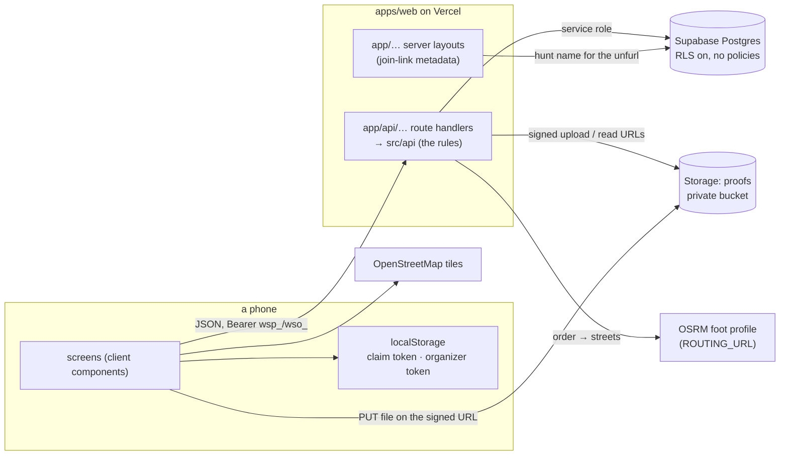

# Walkspot

Photo-proof challenge hunts for groups. An organizer writes a roster and a set
of challenges — some tied to a place on the map, some doable anywhere — and
shares a six-letter code. Each player opens the link on their phone, taps
their own name once, and that phone *is* them for the rest of the hunt. They
prove a challenge with a photo or video, tag whoever did it with them for a
group bonus, and plan the walk between the places that are left.

```
apps/web            one Next.js project → one Vercel project
  app/api/…         the API: route handlers, one thin file per endpoint
  src/api/…         the rules behind them (auth, scoring, routing) — plain TS, tested
  app/…, src/…      the screens
supabase/migrations the schema; applies on merge
ci.config.json      the CI pipeline (@mauur/ci)
```

A native app, if it ever comes, is a second project beside this one that
calls the same `/api`.

## How it works



**One project, two halves.** Everything under `/api` is a Next route handler
that does nothing but name a function in `src/api/<resource>/handlers.ts`;
`src/api/http.ts` is the one adapter (load the hunt, identify the caller,
parse the body, map errors). The rules — tokens, validation, scoring, route
order — are plain TypeScript with no Next import, which is what makes them
testable with `node:test` and reusable by a native client later.

**No accounts.** Two credentials exist and the API mints both:

- a **claim** (`wsp_…`) — this device holds one roster spot. Written once to
  the phone; the app never offers a way to change it. Only an organizer can
  *release* the spot, which logs the phone out on its next request and
  reopens the name. → `apps/web/src/api/auth/README.md`
- an **organizer session** (`wso_…`) — this device knows the hunt's
  passphrase. Created with the hunt, or later by typing the passphrase on
  `/o/<code>`.

**Points are never stored.** A proof is worth
`base × (1 + min(cap, pct × (people − 1)) / 100)` to everyone tagged on it;
per person and challenge only the best approved proof counts — unless the
challenge is repeatable, when it counts once per distinct answer up to
`max_awards` ("which park?", up to ten). The board is derived on every read. Reject a proof, archive a challenge, or change the
bonus, and the board simply moves. → `apps/web/src/api/submissions/README.md`

**Media never touches the API.** The client asks for a signed upload slot,
PUTs the file straight to the private bucket, then files the path. Reads are
signed URLs good for an hour.

**Routes** come from a pure nearest-neighbour + 2-opt order and, when the
router answers, real walking streets; otherwise straight lines drawn dashed.

**The join link unfurls.** `/e/:code` is server-rendered just enough to put
the hunt's name and description in the page metadata, so the link pasted
into a group chat shows what it is. Everything after that is client-side:
the credential lives in the phone.
→ `apps/web/src/api/route/README.md`

## Screens

| path | who | what |
|---|---|---|
| `/` | anyone | enter a code, or create a hunt; hunts this device is on |
| `/new` | anyone | name, passphrase, scoring rule → becomes its organizer |
| `/e/:code` | new phone | pick your name (irreversible, and it says so) |
| `/e/:code` … `/c/:id` `/map` `/feed` `/board` `/me` | player | challenges + score, proof form with tagging, map + route plan, everyone's proofs, leaderboard, and your own page — every proof you are credited on, tagged or not |
| `/o/:code` | organizer | passphrase sign-in, then People (add · release · remove), Challenges (map picker, radius, order), Review (approve/reject with the GPS distance), Feed, Board, Setup (share links, scoring) |

## Setup

```bash
npm run install:all
cp apps/web/.env.example apps/web/.env.local
```

1. **Supabase** — create a project; put the URL and the service-role key in
   `apps/web/.env.local`. Connect the repo under *Integrations → GitHub* so
   `supabase/migrations/` applies on merge (the migration also creates the
   private `proofs` bucket).
2. **Routing** — nothing to do: `ROUTING_URL` defaults to the FOSSGIS foot
   profile. Point it at your own OSRM if the hunt is big, or blank it for
   straight lines only.
3. **Sentry** — optional, one DSN (`NEXT_PUBLIC_SENTRY_DSN`) gates both the
   server and the browser side.

```bash
npm run dev   # http://localhost:3000 — pages and /api together
```

## Deploy

One Vercel project, framework Next.js, Node 22. Set the same three variables
from `.env.example` in the project's environment. There is no OTA or native
build here: a merge to `main` is a deploy.

Two project settings decide whether that sentence is true, and both fail
quietly when wrong:

- **Root Directory must be `apps/web`.** The repo root holds only the
  workspace wrapper, whose `package.json` has no `next` in it, so a build
  at the root dies with *"No Next.js version detected"* — a message that
  reads like a dependency problem and is actually a path problem. No CLI
  command sets this; it is *Settings → Build & Deployment → Root Directory*.
  A `vercel deploy` run from inside `apps/web` sidesteps it, because the
  uploaded directory is the root — which is why a CLI deploy can succeed
  while every git deploy fails.
- **Production Branch must be `main`.** Otherwise pushes to `main` land as
  *preview* and production quietly keeps tracking whatever branch the
  project was imported from. It lives under *Settings → Environments →
  Production → Branch Tracking* — not under Settings → Git, where it used
  to be.

Migrations should apply on merge through Supabase's GitHub integration —
connect the repo under *Integrations → GitHub*. Until that is connected,
`supabase db push` is the only way to apply one, which is how the schema
was first bootstrapped. Keep migrations additive either way, so code and
schema can land in either order.

## Verify

```bash
rm -f apps/web/tsconfig.tsbuildinfo
npm run typecheck && npm test && npm run build
```

Tests are `node:test` over the pure modules (tokens, codes, validation,
scoring, route order, media rules, device sessions, formatting); nothing
needs a database or a browser.
