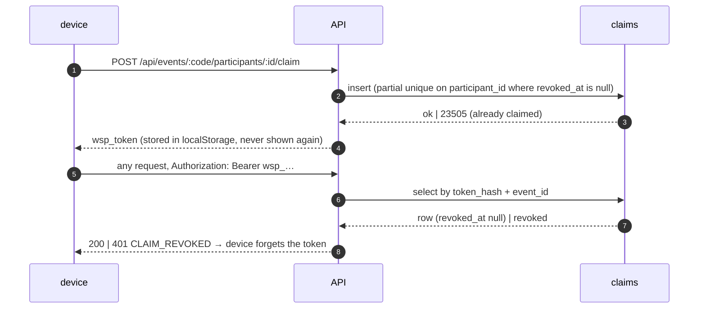

# auth — who is asking

Status: current · Scope: `apps/web/src/api/auth` · Parent: `../../../../README.md` · Owns: tokens, claims, organizer sessions

Walkspot has no accounts. Two credentials exist, both minted by the API and
held by one device:

| token | minted by | names | revoked by |
|---|---|---|---|
| `wsp_…` claim | `POST /events/:code/participants/:id/claim` | one roster spot | an organizer releasing the spot |
| `wso_…` organizer | `POST /events` · `POST /events/:code/organizer` (passphrase) | one organizer device | — (kept for the event's life) |

`tokens.ts` is pure (mint, role-by-prefix, SHA-256 for storage, scrypt for
passphrases). `identify.ts` resolves the bearer on every `/api/events/:code/*`
request after `events/load.ts` has resolved the event; `http.ts`'s
`eventRoute(auth, fn)` enforces which actor a route needs (`participant`,
`organizer`, `anyone`, `none`).

Why a claim cannot be undone from the device: the roster is the guest list, and
a spot changing hands mid-hunt would move points between people. Only an
organizer can release it (`revoked_at`, `revoked_by`), which reopens the spot
and logs that device out on its next request.
