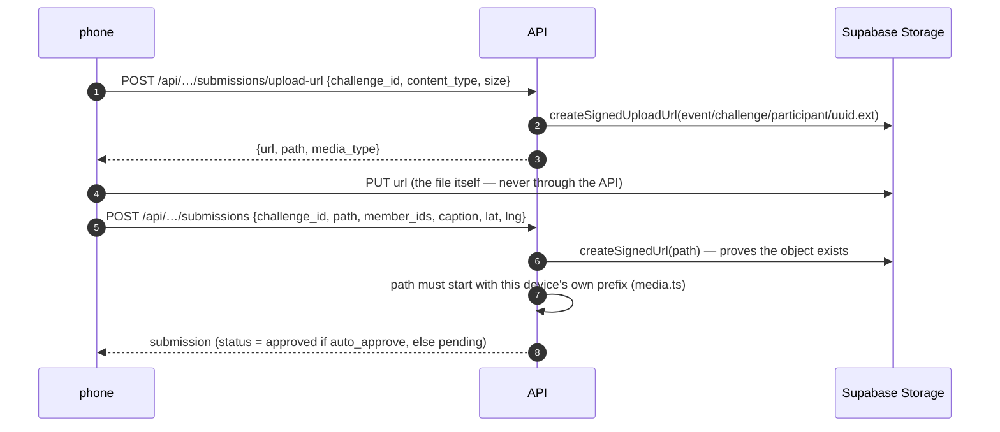

# submissions — proofs and points

Status: current · Scope: `apps/web/src/api/submissions` · Parent: `../../../../README.md` · Owns: upload flow, group credit, scoring, review

A proof is a photo or video of a challenge being done. It lives in the private
`proofs` bucket; the row in `submissions` names the file, the uploader, who
else is credited (`members`), the GPS fix at upload, and the review state.

## Upload

Reads hand back signed URLs good for an hour (`hydrate`). The bucket's
`file_size_limit` and `media.ts`'s `MAX_BYTES` are the same number on purpose.

## Points

`scoring.ts` is the only place a number becomes a score, and it is pure:

- a proof is worth `base × (1 + min(cap, pct × (members − 1)) / 100)`, rounded;
- every credited member gets that amount;
- per person and challenge only the best approved proof counts;
- nothing is stored — reject a proof or archive a challenge and the board moves.

`progressFor` is what a participant's challenge list shows (`todo` /
`pending` / `approved` / `rejected`); `leaderboard` is what `/board` returns.

## Location

When both the challenge and the upload carry a fix, `distance_m` is recorded
and shown to reviewers against the challenge's `radius_m`. It is advisory:
GPS in a courtyard can be 80m off, and a wrong rejection costs more than a
lenient approval. The organizer decides.
